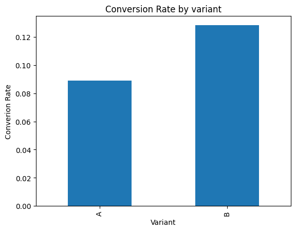

# Statistical-Analysis-of-User-Behavior
Data-Driven Product Optimization: Improving Conversion Rates through Statistical A/B Testing
# A/B Testing & Conversion Rate Optimization

## 📌 Project Objective

To determine whether a new website variant improves conversion rates compared to the existing version.

## 📊 Dataset

Simulated / Kaggle A/B testing dataset containing user interactions and conversion outcomes.

## 🛠 Tools & Technologies

* Python
* Pandas
* SciPy
* Matplotlib
* Google Colab / Jupyter Notebook

## 🔬 Methodology

* Data Cleaning & Exploration
* Conversion Rate Analysis
* Hypothesis Testing (Z-test)
* Statistical Significance Testing
* Data Visualization

## 📈 Results

Variant B showed a higher conversion rate with statistically significant improvement over Variant A.

# A/B Testing Data Analytics Project

## Conversion Rate Visualization

Below is the result of A/B Testing analysis:

## 💡 Business Impact

Results support deploying the new variant to improve product conversions.

## 🚀 Author

Prajakta Patil.
